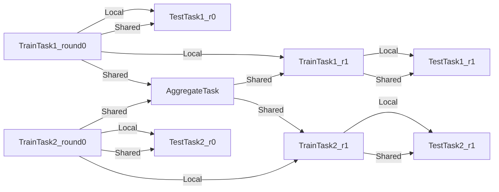
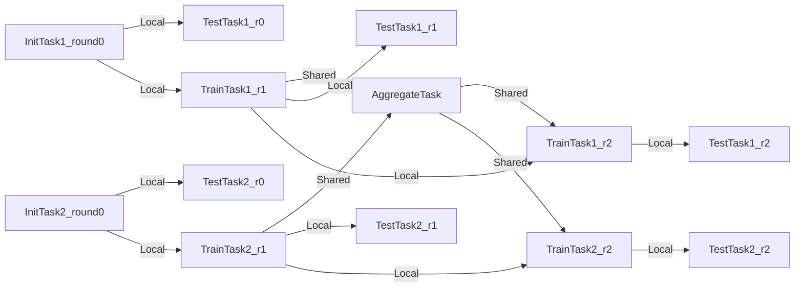

# Changelog

All notable changes to this project will be documented in this file.

The format is based on [Keep a Changelog](https://keepachangelog.com/en/1.0.0/),
and this project adheres to [Semantic Versioning](https://semver.org/spec/v2.0.0.html).

<!-- towncrier release notes start -->

## [1.0.0](https://github.com/Substra/substrafl/releases/tag/1.0.0) - 2024-10-14

### Added

- The `Dependency` object now takes an optional parameter `binary_dependencies` to specify binary packages to be
  installed in the computation container. ([#249](https://github.com/Substra/substrafl/pull/249))

### Changed

- cuda base docker image is now `nvidia/cuda:12.6.1-runtime-ubuntu24.04` ([#248](https://github.com/Substra/substrafl/pull/248))
- Remove parasite verisons of `setuptools` in Dockerfiles and install `setuptools>70.0.0` to tackle last identified CVEs ([#250](https://github.com/Substra/substrafl/pull/250))

### Fixed

- Bump NumPy and pytorch versions in tests. ([#252](https://github.com/Substra/substrafl/pull/252))

### Removed

- Drop Python 3.9 support. ([#247](https://github.com/Substra/substrafl/pull/247))


## [0.47.0](https://github.com/Substra/substrafl/releases/tag/0.47.0) - 2024-09-12

### Added

- Python 3.12 support ([#226](https://github.com/Substra/substrafl/pull/226))
- Add Docker GPU base image, activated through the `Dependency` object with the variable `use_gpu=True`. The Docker image used is `nvidia/cuda:11.8.0-runtime-ubuntu22.04`. ([#227](https://github.com/Substra/substrafl/pull/227))

### Changed

- BREAKING: change `use_gpu` to `diasble_gpu` in all `TorchAlgo`. The device is set to `cpu` is no GPU are available or if `disable_gpu` is set to `True`. You must inverse the boolean in your code to keep the same behaviour (`diasble_gpu == not use_gpu`). ([#241](https://github.com/Substra/substrafl/pull/241))
- Remove packages named `build-essential` and `*-dev` after building dependencies to decrease CVE ([#242](https://github.com/Substra/substrafl/pull/242))

### Fixed

- Add a non-root user to the generated Dockerfile for the compute functions.

  Compute pods were already running as non-root (ensured by a security context in the backend), we are making it more
  explicit here. ([#228](https://github.com/Substra/substrafl/pull/228))
- Added `subprocess_only` tag to prevent simulation mode tests to run in remote mode. ([#229](https://github.com/Substra/substrafl/pull/229))
- Bump pytorch version to 2.2.1 in tests. ([#230](https://github.com/Substra/substrafl/pull/230))
- Bump NumPy version to 1.26.4 in tests. ([#231](https://github.com/Substra/substrafl/pull/231))
- Actually trigger the GPU docker configuration with `use_gpu` flag when running Camelyon benchmark ([#244](https://github.com/Substra/substrafl/pull/244))
- Use Tensor.cpu() to copy the tensor to host memory first in Camelyon benchmark ([#245](https://github.com/Substra/substrafl/pull/245))


## [0.46.0](https://github.com/Substra/substrafl/releases/tag/0.46.0) - 2024-06-03


### Changed

- Add `apt update` to docker user images to limit vulnerabilities. ([#213](https://github.com/Substra/substrafl/pull/213))


## [0.45.0](https://github.com/Substra/substrafl/releases/tag/0.45.0) - 2024-03-27


### Added

- - New CLI arguments to Camelyon benchmark (`--torch-gpu` and `--cp-name`) ([#201](https://github.com/Substra/substrafl/pull/201))

### Changed

- - Apply changes from breaking PR on Substra (#405(https://github.com/Substra/substra/pull/405)) ([#202](https://github.com/Substra/substrafl/pull/202))
- - Depreciate `setup.py` in favour of `pyproject.toml` ([#204](https://github.com/Substra/substrafl/pull/204))


## [0.44.0](https://github.com/Substra/substrafl/releases/tag/0.44.0) - 2024-03-07

### Added

- Add documentation on how to change SubstraFL log level ([#194](https://github.com/Substra/substrafl/pull/194))
- Add the `simulate_experiment` function, that will execute the `Compute Plan` in RAM only. It returns Python objects containing the computed `Performances` and the saved intermediate `States`. More information about this feature is available in docstrings ([#184](https://github.com/Substra/substrafl/pull/184)).

Example of usage:

```py
from substrafl.experiment import simulate_experiment

scores, intermediate_state_train, intermediate_state_agg = simulate_experiment(
    client=my_substra_client,
    strategy=my_strategy,
    train_data_nodes=train_data_nodes,
    evaluation_strategy=my_eval_strategy,
    aggregation_node=aggregation_node,
    clean_models=False,
    num_rounds=NUM_ROUNDS,
)
```

### Changed

- BREAKING: rename ``datasamples``to ``data_from_opener`` ([#193](https://github.com/Substra/substrafl/pull/193))
- Bump documentation dependencies to Sphinx 7.2.6 ([#195](https://github.com/Substra/substrafl/pull/195))
- The predict task does not exist anymore. The evaluation of a model is done in a single task [#177](https://github.com/Substra/substrafl/pull/177)
- `Strategy` implement an `evaluate` method, with the `@remote_data` decorator, to compute the evaluation of the model. The `evaluate` method is the same for all strategies [#177](https://github.com/Substra/substrafl/pull/177)
- BREAKING: the `perform_predict` method of `Strategy` changed in favor of `perform_evaluation` that calls the new `evaluate` method [#177](https://github.com/Substra/substrafl/pull/177)
- BREAKING: `metric_functions` are now passed to the `Strategy` instead of the `TestDataNode` [#177](https://github.com/Substra/substrafl/pull/177)
- BREAKING: the `predict` method of `Algo` has no `@remote_data` decorator anymore. It signatures does not take `prediction_path` anymore, and the predictions are return by the method [#177](https://github.com/Substra/substrafl/pull/177)
- Abstract base class `Node` is replaced by `Protocols`, defined in `substrafl.nodes.protocol.py` ([#185](https://github.com/Substra/substrafl/pull/185))
- BREAKING: rename `test_data_sample_keys`, `test_tasks` and `register_test_operations`, `tasks` to `data_sample_keys` and `register_operations` in `TestDataNodes` ([#185](https://github.com/Substra/substrafl/pull/185))
- BREAKING: `InputIdentifiers` and `OutputIdentifiers` move from `substrafl.nodes.node` to `substrafl.nodes.schemas` ([#185](https://github.com/Substra/substrafl/pull/185))
- Switch to python-slim as base image, instead of substra-tools ([#197](https://github.com/Substra/substrafl/pull/197))
- Dropped support for Python 3.8 ([#200](https://github.com/Substra/substrafl/pull/200))

### Fixed
- Numerical stability of the `NewtonRaphson` strategy is improved by symmetrizing the Hessian ([#196](https://github.com/Substra/substrafl/pull/196))

## [0.43.0](https://github.com/Substra/substrafl/releases/tag/0.43.0) - 2024-02-26

### Changed

- Renamed `function` field of Substra Function pydantic model to `archive`([#181](https://github.com/Substra/substrafl/pull/181))

### Fixed

- Update schemas and tests to remove Pydantic v2 warnings ([#183](https://github.com/Substra/substrafl/pull/183))

## [0.42.0](https://github.com/Substra/substrafl/releases/tag/0.42.0) - 2023-10-18

### Added

- Support on Python 3.11 ([#169](https://github.com/Substra/substrafl/pull/169))

### Changed

- Remove substrafl wheel cache ([#175](https://github.com/Substra/substrafl/pull/175))

### Fixed

- Camelyon benchmark download files ([#182](https://github.com/Substra/substrafl/pull/182))

## [0.41.1](https://github.com/Substra/substrafl/releases/tag/0.41.1) - 2023-10-06

### Fixed

- Fix Newton-Raphson docstring ([#170](https://github.com/Substra/substrafl/pull/170))

## [0.41.0](https://github.com/Substra/substrafl/releases/tag/0.41.0) - 2023-09-08

### Changed

- Update to pydantic 2.3.0 ([#159](https://github.com/Substra/substrafl/pull/159))

## [0.40.0](https://github.com/Substra/substrafl/releases/tag/0.40.0) - 2023-09-07

### Added

- Check the Python version used before generating the Dockerfile ([#155](<https://github.com/Substra/substrafl/pull/155>)).
- Python dependencies can be resolved using pip compile during function registration by setting `compile` to `True`
  in the `Dependency` object ([#155](<https://github.com/Substra/substrafl/pull/155>)).

  ```py
  Dependency(
        pypi_dependencies=["pytest", "numpy"],
        compile=True,
    )
  ```

- Dependency objects are now computed at initialization in a cache directory, accessible through the `cache_directory` attribute. The cache directory is deleted at the Dependency object deletion. ([#155](<https://github.com/Substra/substrafl/pull/155>))
- Check created wheels name. ([#160](https://github.com/Substra/substrafl/pull/160))

### Changed

- BREAKING: Rename `generate_wheel.py` to `manage_dependencies.py` ([#156](https://github.com/Substra/substrafl/pull/156))
- BREAKING: Move `manage_dependencies.py` from `remote.register` to `dependency` ([#158](https://github.com/Substra/substrafl/pull/158))
- BREAKING: `local_dependencies` is renamed `local_installable_dependencies` ([#158](https://github.com/Substra/substrafl/pull/158))
- BREAKING: local_installable_dependencies are now limited to local modules or Python wheels (no support for bdist, sdist...) ([#155](<https://github.com/Substra/substrafl/pull/155>)).

### Fixed

- Set, save & load `random.seed` and `np.random.seed` along with `torch.manual_seed` in `TorchAlgo`([#151](https://github.com/Substra/substrafl/pull/151))
- Keep the last round task output by default ([#162](https://github.com/Substra/substrafl/pull/162))

## [0.39.0](https://github.com/Substra/substrafl/releases/tag/0.39.0) - 2023-07-25

### Changed

- BREAKING: Input and output of aggregate tasks are now `shared_state`. It provides more flexibility to link different type of tasks with each other. To use
  `download_aggregate_shared_state` on experiments launched before this commit, you can use the following code as a replacement of the function
  ([#142](https://github.com/Substra/substrafl/pull/142)).

```py
import tempfile

from substrafl.model_loading import _download_task_output_files
from substrafl.model_loading import _load_from_files

with tempfile.TemporaryDirectory() as temp_folder:
    _download_task_output_files(
        client=<client>,
        compute_plan_key=<compute_plan_key>,
        dest_folder=temp_folder,
        round_idx=<round_idx>,
        rank_idx=<rank_idx>,
        task_type="aggregate",
        identifier="model",
    )
    aggregated_state = _load_from_files(input_folder=temp_folder, remote=True)
```

### Removed

- Function `wait` in `utils`. You can use `substra.Client.wait_task` & `substra.Client.wait_compute_plan` instead. ([#147](https://github.com/Substra/substrafl/pull/147))

### Fixed

- Compatibility with GPU devices when running torch based experiments ([#154](https://github.com/Substra/substrafl/pull/154))
- Pin `pydantic` to `>=1.9.0` & `<2.0.0` as `pydantic` v `2.0.0` has been released with a lot of non backward compatible changes. ([#148](https://github.com/Substra/substrafl/pull/148))

## [0.38.0](https://github.com/Substra/substrafl/releases/tag/0.38.0) - 2023-06-27

### Changed

- BREAKING: Rename `model_loading.download_shared_state` to `model_loading.download_train_shared_state` ([#143](https://github.com/Substra/substrafl/pull/143))
- BREAKING: Rename `model_loading.download_aggregated_state` to `model_loading.download_aggregate_shared_state` ([#143](https://github.com/Substra/substrafl/pull/143))
- Numpy < 1.24 in dependencies to keep pickle compatibility with substra-tools numpy version ([#144](https://github.com/Substra/substrafl/pull/144))

## [0.37.0](https://github.com/Substra/substrafl/releases/tag/0.37.0) - 2023-06-12

### Added

- ComputePlanBuilder base class to define which method are needed to implement a custom strategy in SubstraFL.
  These methods are `build_compute_plan`, `load_local_states` and `save_local_states`. [#120](https://github.com/Substra/substrafl/pull/120)
- Check and test on string used as metric name in test data nodes ([#122](https://github.com/Substra/substrafl/pull/122)).
- Add default exclusion patterns when copying file to avoid creating large Docker images ([#118](https://github.com/Substra/substrafl/pull/118))
- Add the possibility to force the Dependency editable_mode through the environment variable SUBSTRA_FORCE_EDITABLE_MODE ([#131](https://github.com/Substra/substrafl/pull/131))

## Changed

- BREAKING: depreciate the usage of `model_loading.download_algo_files` and `model_loading.load_algo` functions. New utils functions are now available. ([#125](https://github.com/Substra/substrafl/pull/125))
  `model_loading.download_algo_state` to download a SubstraFL algo of a given round or rank.
  `model_loading.download_shared_state` to download a SubstraFL shared object of a given round or rank.
  `model_loading.download_aggregated_state` to download a SubstraFL aggregated of a given round or rank.
  The API change goes from:

  ```py
  algo_files_folder = str(pathlib.Path.cwd() / "tmp" / "algo_files")

  download_algo_files(
    client=client_to_download_from,
    compute_plan_key=compute_plan.key,
    round_idx=round_idx,
    dest_folder=algo_files_folder,
  )

  model = load_algo(input_folder=algo_files_folder).model
  ```

  to

  ```py
  algo = download_algo_state(
    client=client_to_download_from  ,
    compute_plan_key=compute_plan.key,
    round_idx=round_idx,
  )

  model = algo.model
  ```

- BREAKING: rename `build_graph` to `build_compute_plan`. ([#120](https://github.com/Substra/substrafl/pull/120))
- BREAKING: move `schema.py` into the `strategy` module. ([#120](https://github.com/Substra/substrafl/pull/120))

  ```py
  from substrafl.schemas import FedAvgSharedState
  # Become
  from substrafl.strategies.schemas import FedAvgSharedState
  ```

- Way to copy function files ([#118](https://github.com/Substra/substrafl/pull/118))
- `download_train_task_models_by_rank` uses new function `list_task_output_assets` instead of using `value` that has been removed ([#129](https://github.com/Substra/substrafl/pull/129))

### Fixed

- New dependencies copy method in Docker mode.([#130](https://github.com/Substra/substrafl/pull/130))

## [0.36.0](https://github.com/Substra/substrafl/releases/tag/0.36.0) - 2023-05-11

### Fixed

- Close issue [#114](https://github.com/Substra/substrafl/issues/114). Large batch size are set to the number of samples in predict for NR and FedPCA. ([#115](https://github.com/Substra/substrafl/pull/115))

### Changed

- BREAKING: Metrics are now given as `metric_functions` and not as `metric_key`. The functions given as metric functions to test data nodes are automatically registered in a new Substra function by SubstraFL. ([#117](https://github.com/Substra/substrafl/pull/117)).
  The new argument of the TestDataNode class `metric_functions` replaces the `metric_keys` one and accepts a dictionary (using the key as the identifier of the function given as value), a list of functions or directly a function if there is only one metric to compute (`function.__name__` is then used as identifier).
  Installed dependencies are the `algo_dependencies` passed to `execute_experiment`, and permissions are the same as the predict function.

  From a user point of view, the metric registration changes from:

  ```py
  def accuracy(datasamples, predictions_path):
    y_true = datasamples["labels"]
    y_pred = np.load(predictions_path)

    return accuracy_score(y_true, np.argmax(y_pred, axis=1))

  metric_deps = Dependency(pypi_dependencies=["numpy==1.23.1", "scikit-learn==1.1.1"])

  permissions_metric = Permissions(public=False, authorized_ids=DATA_PROVIDER_ORGS_ID)

  metric_key = add_metric(
      client=client,
      metric_function=accuracy,
      permissions=permissions_metric,
      dependencies=metric_deps,
  )

  test_data_nodes = [
      TestDataNode(
          organization_id=org_id,
          data_manager_key=dataset_keys[org_id],
          test_data_sample_keys=[test_datasample_keys[org_id]],
          metric_keys=[metric_key],
      )
      for org_id in DATA_PROVIDER_ORGS_ID
  ]
  ```

  to:

  ```py
  def accuracy(datasamples, predictions_path):
    y_true = datasamples["labels"]
    y_pred = np.load(predictions_path)

    return accuracy_score(y_true, np.argmax(y_pred, axis=1))

  test_data_nodes = [
      TestDataNode(
          organization_id=org_id,
          data_manager_key=dataset_keys[org_id],
          test_data_sample_keys=[test_datasample_keys[org_id]],
          metric_functions={"Accuracy": accuracy},
      )
      for org_id in DATA_PROVIDER_ORGS_ID
  ]
  ```

- Enforce kwargs for user facing function with more than 3 parameters ([#109](https://github.com/Substra/substrafl/pull/109))
- Remove references to `composite`. Replace by `train_task`. ([#108](https://github.com/Substra/substrafl/pull/108))

### Added

- Add the Federated Principal Component Analysis strategy ([#97](https://github.com/Substra/substrafl/pull/97))

## [0.35.1](https://github.com/Substra/substrafl/releases/tag/0.35.1) - 2023-04-11

### Changed

- Change order of layers in the Dockerfile: files are copied as needed before the installation layers, and the final copy
  is made last. ([#110](https://github.com/Substra/substrafl/pull/110))

## [0.35.0](https://github.com/Substra/substrafl/releases/tag/0.35.0) - 2023-03-31

### Added

- Initialization task to each strategy in SubstraFL. ([#89](https://github.com/Substra/substrafl/pull/89))

This allows to load the `Algo` and all its attributes to the platform before any training? Once on the platform, we can perform a testing task before any training.
This init task consists in submitting an empty function, coded in the `BaseAlgo`class.

```py
@remote
def initialize(self, shared_states):
     return
```

The init task return a `local` output that will be passed as input to a test task, and to the first train task.

The graph pass from:



to:



### Changed

- BREAKING: `algo` are now passed as parameter to the `strategy` and not to `execute_experiement` anymore ([#98](https://github.com/Substra/substrafl/pull/98))
- BREAKING A `strategy` need to implement a new method `build_graph` to build the graph of tasks to be execute in `execute_experiment` ([#98](https://github.com/Substra/substrafl/pull/98))
- BREAKING: `predict` method of `strategy` has been renamed to `perform_predict` ([#98](https://github.com/Substra/substrafl/pull/98))
- Test tasks don't take a `shared` as input anymore ([#89](https://github.com/Substra/substrafl/pull/89))
- BREAKING: change `eval_frequency` default value to None to avoid confusion with hidden default value (#91)
- BREAKING: rename Algo to Function ([#82](https://github.com/Substra/substrafl/pull/82))
- BREAKING: clarify `EvaluationStrategy` arguments: change `rounds` to `eval_frequency` and `eval_rounds` (#85)
- replace `schemas.xxx` by `substra.schemas.xxx` ([#105](https://github.com/Substra/substrafl/pull/105))

### Fixed

- BREAKING: Given local code dependencies are now copied to the level of the running script systematically ([#99](https://github.com/Substra/substrafl/pull/99/files))
- Docker images are pruned in main check of Github Action to free disk space while test run ([#102](https://github.com/Substra/substrafl/pull/102))
- Pass `aggregation_lr` to the parent class for Scaffold. Fix [issue 103](https://github.com/Substra/substrafl/issues/103) ([#104](https://github.com/Substra/substrafl/pull/104))

### Removed

- `from substra import schemas` in `aggregation_node.py`, `test_data_node.py` and `train_data_node.py` ([#105](https://github.com/Substra/substrafl/pull/105))

## [0.34.0](https://github.com/Substra/substrafl/releases/tag/0.34.0) - 2023-02-20

### Added

- Possibility to test on an organization where no training has been performed (#74)
- Add contributing, contributors & code of conduct files (#68)

### Removed

- Test only field for datasamples (#67)

### Changed

- Remove RemoteDataMethod and change RemoteMethod class to be fully flexible regarding function name.
  The substra-tools methods is now generic, and load the inputs depending on the inputs dictionary content (#59)
- BREAKING: rename tuple to task (#79)

## [0.33.0](https://github.com/Substra/substrafl/releases/tag/0.33.0) - 2022-12-19

### Changed

- test: add Github Action to run subprocess tests on Windows after each merge (#60)
- test: pass the CI e2e tests on Python 3.10 (#56)

### Fixed

- # fix: bug introduced with numpy 1.24 and cloudpickle: TypeError: \_\_generator_ctor(). Remove version from requirements. ([Issue open](https://github.com/cloudpipe/cloudpickle/issues/493))

- fix: bug introduced with numpy 1.24 and cloudpickle: TypeError: \_\_generator_ctor(). Remove version from requirements.

## [0.32.0](https://github.com/Substra/substrafl/releases/tag/0.32.0) - 2022-11-22

### Added

- The metric registration is simplified. The user can now directly write a score function within
  their script, and directly register it by specifying the right dependencies and permissions.
  The score function must have `(datasamples, predictions_path)` as signature. (#47)

  Example of new metric registration:

  ```py
  metric_deps = Dependency(pypi_dependencies=["numpy==1.23.1"])
  permissions_metric = Permissions(public=True)

  def mse(datasamples, predictions_path):
      y_true = datasamples["target"]
      y_pred = np.load(predictions_path)
      return np.mean((y_true - y_pred)**2)


  metric_key = add_metric(
      client=substra_client,
      permissions=permissions_metric,
      dependencies=metric_deps,
      metric_function=mse,
  )
  ```

- doc on the model loading page (#40)
- The round 0 is now exposed.
  Possibility to evaluate centralized strategies before any training (FedAvg, NR, Scaffold).
  The round 0 is skipped for single org strategy and cannot be evaluated before training (#46)

### Changed

- Github actions on Ubuntu 22.04 (#52)
- torch algo: test that `with_batch_norm_parameters` is only about the running mean and variance of the batch norm layers (#30)
- torch algo: `with_batch_norm_parameters` - also take into account the `torch.nn.LazyBatchNorm{x}d` layers (#30)
- chore: use the generic task (#31)
- Apply changes from algo to function in substratools (#34)
  - add `tools_functions` method to `RemoteDataMethod` and `RemoteMethod` to return the function(s) to send to `tools.execute`.
- Register functions in substratools using decorator `@tools.register` (#37)
- Update substratools Docker image (#49)

### Fixed

- Fix python 3.10 compatibility by catching OSError for Notebooks (#51)
- Free disk space in main github action to run the CI (#48)
- local dependencies are installed in one `pip` command to optimize the installation and avoid incompatibilities error (#39)
- Fix error when installing current package as local dependency (#41)
- Fix flake8 repo for pre-commit (#50)

## [0.31.0](https://github.com/Substra/substrafl/releases/tag/0.31.0) - 2022-10-03

### Removed

- algo category from algo as it is not required by substra anymore

### Fixed

- documentation of the `predict` function of Algos was not up to date (#33)

## [0.30.0](https://github.com/Substra/substrafl/releases/tag/0.30.0) - 2022-09-26

### Removed

- Return statement of both `predict` and `_local_predict` methods from Torch Algorithms.

### Tests

- Update the Client, it takes a backend type instead of debug=True + env variable to set the spawner - (#210)
- Do not use Model.category since this field is being removed from the SDK
- Update the tests and benchmark with the change on Metrics from substratools (#24)

### Changed

- NOTABLE CHANGES due to breaking changes in substra-tools:
  - the opener only exposes `get_data` and `fake_data` methods
  - the results of the above method is passed under the `datasamples` keys within the `inputs` dict arg of all
    tools methods (train, predict, aggregate, score)
  - all method (train, predict, aggregate, score) now takes a `task_properties` argument (dict) in addition to
    `inputs` and `outputs`
  - The `rank` of a task previously passed under the `rank` key within the inputs is now given in the `task_properties`
    dict under the `rank` key

This means that all `opener.py` file should be changed from:

```py
import substratools as tools

class TestOpener(tools.Opener):
    def get_X(self, folders):
      ...

    def get_y(self, folders):
      ...

    def fake_X(self, n_samples=None):
      ...

    def fake_y(self, n_samples=None):
      ...
```

to:

```py
import substratools as tools

class TestOpener(tools.Opener):
    def get_data(self, folders):
      ...

    def fake_data(self, n_samples=None):
      ...
```

This also implies that `metrics` has now access to the results of `get_data`
and not only `get_y` as previously. The user should adapt all of his `metrics` file accordingly e.g.:

```py
class AUC(tools.Metrics):
    def score(self, inputs, outputs):
        """AUC"""
        y_true = inputs["y"]
        ...

    def get_predictions(self, path):
        return np.load(path)

if __name__ == "__main__":
    tools.metrics.execute(AUC())
```

could be replace with:

```py
class AUC(tools.Metrics):
    def score(self, inputs, outputs, task_properties):
        """AUC"""
        datasamples = inputs["datasamples"]
        y_true = ... # getting target from the whole datasamples

    def get_predictions(self, path):
        return np.load(path)

if __name__ == "__main__":
    tools.metrics.execute(AUC())
```

- BREAKING CHANGE: `train` and `predict` method of all substrafl algos now takes `datasamples` as argument instead of `X` abd `y`. This is impacting the user code only
  if he or she overwrite those methods instead of using the `_local_train` and `_local_predict` methods.
- BREAKING CHANGE: The result of the `get_data` method from the opener is automatically provided to the given `dataset` as `__init__` arg
  instead of `x` and `y` within the `train` and `predict` methods of all `Torch*Algo` classes. The user `dataset` should be adapted
  accordingly e.g.:

```py
from torch.utils.data import Dataset

class MyDataset(Dataset):
    def __init__(self, x, y, is_inference=False) -> None:
        ...

class MyAlgo(TorchFedAvgAlgo):
    def __init__(
        self,
    ):
        torch.manual_seed(seed)
        super().__init__(
            model=my_model,
            criterion=criterion,
            optimizer=optimizer,
            index_generator=index_generator,
            dataset=MyDataset,
        )
```

should be replaced with

```py
from torch.utils.data import Dataset

class MyDataset(Dataset):
    def __init__(self, datasamples, is_inference=False) -> None:
        ...

class MyAlgo(TorchFedAvgAlgo):
    def __init__(
        self,
    ):
        torch.manual_seed(seed)
        super().__init__(
            model=my_model,
            criterion=criterion,
            optimizer=optimizer,
            index_generator=index_generator,
            dataset=MyDataset,
        )
```

## [0.29.0](https://github.com/Substra/substrafl/releases/tag/0.29.0) - 2022-09-19

### Changed

- Use the new Substra SDK feature that enable setting the `transient` flag on tasks instead of `clean_models` on compute plans to remove intermediary models.

## [0.28.0](https://github.com/Substra/substrafl/releases/tag/0.28.0) - 2022-09-12

### Fixed

- Throw an error if `pytorch 1.12.0` is used.
  There is a regression bug in `torch 1.12.0`, that impacts optimizers that have been pickled and unpickled. This bug occurs for Adam optimizer for example (but not for SGD). Here is a link to one issue covering it: <https://github.com/pytorch/pytorch/pull/80345>

### Changed

- Removing `classic-algos` from the benchmark dependencies
- NOTABLE CHANGES due to breaking changes in substra-tools: the user must now pass the method name to execute from the
  tools defined class within the dockerfile of both `algo` and `metric` under the `--method-name` argument:

  ```Dockerfile
  ENTRYPOINT ["python3", "metrics.py"]
  ```

  shall be replaced by:

  ```Dockerfile
  ENTRYPOINT ["python3", "metrics.py", "--method-name", "score"]
  ```

- Use the new Susbtra sdk features that return the path of the downloaded file. Change the `model_loading.py`implementation and the tests.

### Features

- In the PyTorch algorithms, move the data to the device (GPU or CPU) in the training loop and predict function so that the user does not need to do it.
- Rename connect-tools docker images to substra-tools
- Benchmark:
  - use public data hosted on Zenodo for the benchmark

### Tests

- Fix the GPU test to the last breaking changes, and unskip the `use_gpu=False` case

### Documentation

- Update the NpIndexGenerator docstrings to add information how to use it as a full epoch index generator.

## 0.27.0 - 2022-08-29

### Changed

- BREAKING CHANGES:
  - an extra argument `predictions_path` has been added to both `predict` and `_local_predict` methods from all `*TorchAglo` classes.
    The user now have to use the `_save_predictions` method to save its predictions in `_local_predict`.
    The user defined metrics will load those saved prediction with `np.load(inputs['predictions'])`.
    The `_save_predictions` method can be overwritten.

Default `_local_predict` method from substrafl algorithms went from:

```python
def _local_predict(self, predict_dataset: torch.utils.data.Dataset):
        if self._index_generator is not None:
            predict_loader = torch.utils.data.DataLoader(predict_dataset, batch_size=self._index_generator.batch_size)
        else:
            raise BatchSizeNotFoundError(
                "No default batch size has been found to perform local prediction. "
                "Please overwrite the _local_predict function of your algorithm."
            )

        self._model.eval()

        predictions = torch.Tensor([])
        with torch.inference_mode():
            for x in predict_loader:
                predictions = torch.cat((predictions, self._model(x)), 0)

        return predictions
```

to

```python
def _local_predict(self, predict_dataset: torch.utils.data.Dataset, predictions_path: Path):

      if self._index_generator is not None:
          predict_loader = torch.utils.data.DataLoader(predict_dataset, batch_size=self._index_generator.batch_size)
      else:
          raise BatchSizeNotFoundError(
              "No default batch size has been found to perform local prediction. "
              "Please overwrite the _local_predict function of your algorithm."
          )

      self._model.eval()

      predictions = torch.Tensor([])
      with torch.inference_mode():
          for x in predict_loader:
              predictions = torch.cat((predictions, self._model(x)), 0)

      self._save_predictions(predictions, predictions_path)

      return predictions
```

- NOTABLE CHANGES due to breaking changes in connect-tools.
  - both `load_predictions` and `get_predictions` methods have been removed from the opener
  - the user defined `metrics` now takes `inputs` and `outputs` as argument.
    - `inputs` is a dict containing:
      - `rank`: int
      - `y`: the result of `get_y` applied to the task datasamples
      - `predictions`: a file path where the output predictions of the user defined algo has been saved.
        As stated above, those predictions can be load thanks to `np.load` if the user didn't overwrite the
        `_save_predictions` methods from substrafl defined `*Algo`.
    - `outputs` is a dict containing:
      - `performance`: a file path where to save the result of the metrics. It must be done through the `tools.save_performance` function.

Instead of:

```python
import substratools as tools
from sklearn.metrics import roc_auc_score


class AUC(tools.MetricAlgo):
   def score(self, y_true, y_pred):
       """AUC"""
       metric = roc_auc_score(y_true, y_pred) if len(set(y_true)) > 1 else 0

       return float(metric)


if __name__ == "__main__":
   tools.algo.execute(AUC())
```

the metric files should look like:

```python
import numpy as np
import substratools as tools
from sklearn.metrics import roc_auc_score


class AUC(tools.MetricAlgo):
    def score(self, inputs, outputs):
        """AUC"""

        y_pred = np.load(inputs["predictions"])
        y_true = inputs["y"]

        metric = roc_auc_score(y_true, y_pred) if len(set(y_true)) > 1 else 0

        tools.save_performance(float(metric), outputs["performance"])


if __name__ == "__main__":
    tools.algo.execute(AUC())
```

## 0.26.0 - 2022-08-22

### Removed

- Documentation for the `_skip` argument from the `_local_predict` and `_local_train` methods of `Torch*Algo`.

## 0.25.0 - 2022-08-17

### Fixed

- Update the inputs/outputs to make them compatible with the task execution

## 0.24.0 - 2022-08-09

### Fixed

- GPU execution: move the RNG state to CPU in case the checkpoint has been loaded on the GPU
- fix: rng state for torch algos. Add test for both stability between organizations and rounds.

### Added

- feat: `_local_predict` has been re added
- feat: add default batching to `predict`
- BREAKING CHANGE: drop Python 3.7 support

### Changed

- BREAKING CHANGE: the library is now named "substrafl"

## 0.23.0 - 2022-08-01

- feat: add compute task inputs

## 0.22.0 - 2022-07-25

### Fixed

- fix: support several items in the `Dependency` - `local_dependencies` field

### Added

- feat: add compute task output
- BREAKING CHANGE: add the torch Dataset as argument of TorchAlgo to preprocess the data
  The `_init_` function of the dataset must contain (self, x, y, is_inference).
  The `__getitem__` function is expected to return x, y if is_inference is False, else x.
  This behavior can be changed by re-writing the `_local_train` or `predict` methods.
  `_local_train` is no longer mandatory to overwrite any more. Its signature passed from `(x, y)` to `(train_dataset)`
  `_local_predict` has been deleted.
  `_get_len_from_x` has been deleted.

### Changed

- feat: the compute plan tasks are uploaded to Connect using the auto-batching feature (it should solve gRPC message errors for large compute plans)

## 0.21.0 - 2022-07-11

### Changed

- BREAKING CHANGE: convert (test task) to (predict task + test task)

### Added

- Added functions to download the model of a strategy :

  - The function `substrafl.model_loading.download_algo_files` downloads the files needed to load the output model of a strategy
    according to the given round. These files are downloaded to the given folder.

  - The `substrafl.model_loading.load_algo` function to load the output model of a strategy from the files previously downloaded via the
    the function `substrafl.model_loading.download_algo_files` .

  Those two functions works together:

  ```python
  download_algo_files(client=substra_client, compute_plan_key=key, round_idx=None, dest_folder=session_dir)
  model = load_algo(input_folder=session_dir)
  ```

## 0.20.0 - 2022-07-05

### Added

- compatibility with substra 0.28.0

## 0.19.0 - 2022-06-27

### Added

- feat: Newton Raphson strategy

## 0.18.0 - 2022-06-20

### Fixed

- added [packaging](https://github.com/pypa/packaging) to the install requirements

## Changed

- Stop using metrics APIs, use algo APIs instead

## 0.17.0 - 2022-06-14

### Changed

- BREAKING CHANGE: Strategy rounds starts at `1` and initialization round is now `0`. It used to start at `0`
  and the initialization round was `-1`
  For each composite train tuple, aggregate tuple and test tuple the meta data `round_idx` has changed
  accordingly to the rule stated above.
- BREAKING CHANGE: rename node to organization in Connect
- Rename the `OneNode` strategy to `SingleOrganization`

### Added

- when using the `TorchScaffoldAlgo`:
  - The number of time the `_scaffold_parameters_update` method must be called within the `_local_train` method is now checked
  - A warning is thrown if an other optimizer than `SGD`
  - If multiple learning rates are set for the optimizer, a warning is thrown and the smallest learning rate is used for
    the shared state aggregation operation. `0` is not considered as a learning rate for this choice as it could be used to
    deactivate the learning process of certain layers from the model.

## 0.16.0 - 2022-06-07

### Changed

- BREAKING CHANGE: add initialization round to centralized strategies :
  - Each centralized strategy starts with an initialization round composed of one composite train tuple on each train data node
  - One round of a centralized strategy is now: `Aggregation` -> `Training on composite`
  - Composite train tuples before test tuples have been removed
  - All torch algorithm have now a common `predict` method
  - The `algo` argument has been removed from the `predict` method of all strategies
  - The `fake_traintuple` attribute of the `RemoteStruct` class has been removed

The full discussion regarding this feature can be found [here](https://github.com/owkin/tech-team/pull/128)

## 0.15.0 - 2022-05-31

### Added

- feat: meaningful name for algo . You can use the `_algo_name` parameter to set a custom algo name for the registration. By default, it is set to `method-name_class-name`.

  ```py
  algo.train(
            node.data_sample_keys,
            shared_state=self.avg_shared_state,
            _algo_name=f"Training with {algo.__class__.__name__}",
            )
  ```

## 0.14.0 - 2022-05-23

### Added

- chore: add latest connect-tools docker image selection
- Torch algorithms now support GPUs, there is a parameter `use_gpu` in the `__init__` of the Torch algo classes.
  If `use_gpu` is True and there is no GPU detected, the code runs on CPU.

### Changed

- The wheels of the libraries installed with `editable=True` are now in `$HOME/.substrafl` instead of `$LIB_PATH/dist`
- benchmark:
  - `make benchmark` runs the default remote benchmark on the connect platform specified in the [config file](./benchmark/camelyon/connect_conf/ci.yaml)
  - `make benchmark-local` runs the default local benchmark in subprocess mode

## 0.13.0 - 2022-05-16

### Changed

- BREAKING CHANGE: replace "tag" argument with "name" in execute_experiment

- `execute_experiment` checks that the algo and strategy are compatible. You can override the list of strategies the
  algo is compatible with using the `strategies` property :

  ```python
  from substrafl.algorithms.algo import Algo
  from substrafl import StrategyName

  class MyAlgo(Algo):
      @property
      def strategies(self):
          return [StrategyName.FEDERATED_AVERAGING, StrategyName.SCAFFOLD]
      # ...
  ```

## 0.12.0 - 2022-05-09

### Added

- feat: the compute plan key of the experiment is saved in the experiment summary before submitting or executing it

## 0.11.0 - 2022-05-03

### Added

- feat: add the possibility for the user to pass additional metadata to the compute plan metadata

### Fixed

- Force the reinstallation of connect-tools in the Docker image, necessary for the editable mode

### Changed

- BREAKING CHANGE: the default value of `drop_last` in the `NpIndexGenerator` is now False

- BREAKING CHANGE: the index generator is now required when implementing a strategy

  ```python
  from substrafl.index_generator import NpIndexGenerator

  nig = NpIndexGenerator(
        batch_size=batch_size,
        num_updates=num_updates,
        drop_last=False,  # optional, defaults to False
        shuffle=True,  # optional, defaults to True
    )

  class MyAlgo(TorchFedAvgAlgo):
    def __init__(self):
        super().__init__(
            index_generator=nig,
            # other parameters
        )
    # ...
  ```

- The user can now initialize his `TorchAlgo` function with custom parameters (only primitive types are supported) :

  ```python
  class MyAlgo(TorchFedAvgAlgo):
      def __init__(self, my_arg):
          super.__init__(
              model=model,
              criterion=criterion
              optimizer=optimizer,
              index_generator=nig,
              my_arg=my_arg,  # This is necessary
          )
          # ...
  ```

## 0.10.0 - 2022-04-19

### Fixed

- Fix the format of the asset ids: the right format is `str(uuid.uuid4())` and not `uuid.uuid4().hex`

## 0.9.0 - 2022-04-11

## Changed

- feat: rename "compute_plan_tag" to "tag" #131
- feat: Add the optional argument "compute_plan_tag" to give the user the possibility to choose its own tag (timestamp by default) #128
- feat: Scaffold strategy
- feat: add one node strategy
- The Connect tasks have a `round_idx` attribute in their metadata
- doc: add python api to documentation

### Improved

- API documentation: fix the docstrings and the display of the documentation for some functions
- (BREAKING CHANGE) FedAvg strategy: the train function must return a FedAvgSharedState, the average function returns a FedAvgAveragedState.
  No need to change your code if you use TorchFedAvgAlgo
- benchmark:
  - Use the same batch sampler between the torch and Substrafl examples
  - Make it work with `num_workers` > 0
  - Explain the effect of the sub-sampling
  - Update the default benchmark parameters in `benchmarks.sh`
  - Add new curves to the plotting: when one parameter changes while the others stay the same
  - Use connect-tools 0.10.0 as a base image for the Dockerfile

### Fixed

- fix: naming changed from FedAVG to FedAvg
- fix: log a warning if an existing wheel is used to build the docker image

## 0.8.0 - 2022-03-01

### Fixed

- fix: `execute_experiment` has no side effects on its arguments
- fix: `Dependency.local_package` are installed in no editable mode and additionally accepts `pyproject.yaml` as configuration file
- fix: `execute_experiment` accepts `None` as `evaluation_strategy`
- fix: The `substrafl.algorithms.algo.Algo` `abstractmethod` decorator is now taken into account

### Improved

- feat: `EvaluationStrategy` can now be reinitialized
- Refactoring `substrafl.algorithms.pytorch.fed_avg.TorchFedAvgAlgo` :
  - replace the `_preprocess` and `_postprocess` functions by `_local_train` and `_local_predict`
  - the user can override the `_get_len_from_x` function to get the number of samples in the dataset from x
  - `batch_size` is now a required argument, and a warning is issued if it is None
- The `substrafl.index_generator.np_index_generator.NpIndexGenerator` class now works with `torch.utils.data.DataLoader`, with `num_workers` > 0
- The benchmark uses `substrafl.algorithms.pytorch.fed_avg.TorchFedAvgAlgo` instead of its own custom algorithm
- Add the `clean_models` option to the `execute_experiment` function

### Added

- feat: make a base class for the index generator and document it
- The `Algo` now exposes a `model` property to get the model after downloading it from Connect
- (BREAKING CHANGE) experiment summary is saved as a json in `experiment_folder`

## 0.7.0 - 2022-02-01

### Fixed

- fix: notebook dependency failure
  You can now run a substrafl experiment with local dependencies in a Jupyter notebook

### Added

- feat: models can now be tested every n rounds, on the same nodes they were trained on
  This feature introduces a new parameter `evaluation_strategy` in `execute_experiment`, which takes an `EvaluationStrategy` instance from `substrafl.evaluation_strategy`.
  If this parameter is not given, performance will not be measured at all (previously, it was measured at the end of the experiment by default).

- feat: install substrafl from pypi

## 0.6.0 - 2021-12-31

### Fixed

- fix: Update pydantic version to enable autocompletion

### Added

- feat: Add a FL algorithm wrapper in PyTorch for the federated averaging strategy
- test: connect-test integration
- feat: Add a possibility to test an algorithm on selected rounds or every n rounds

## 0.5.0 - 2021-12-31

### Fixed

- fix: dependency management: the `local_code` dependencies are copied to the same folder structure relatively to the algo
- fix: dependency management - it failed when resolving the `local_code` dependencies because the path to the algo was relative

### Added

- feat: batch indexer
- feat: more logs + function to set the logging level
- Subprocess mode is now faster as it fully reuses the user environment instead of re building the connect related parts (substra #119 and #63)

## 0.4.0 - 2021-12-10

### Fixed

- fix: error message for local dependency

## 0.3.0 - 2021-11-29

### Added

- feat: User custom dependencies
- feat: support substra subprocess mode

## 0.2.0 - 2021-11-08

- first release
